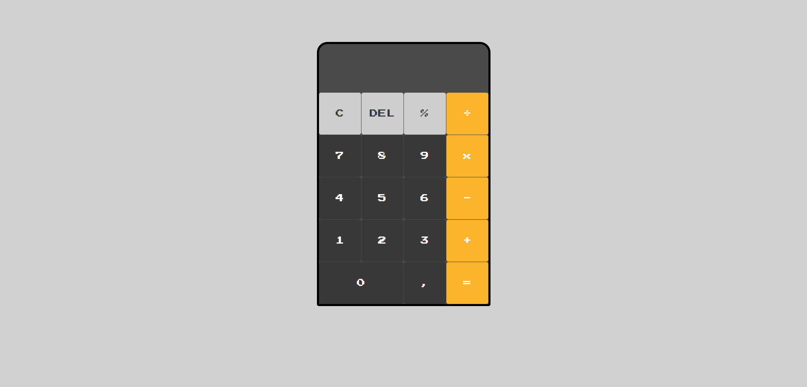

<h1 align="center">
Calculator with JavaScript
</h1>

## Sobre o Projeto

* CalculadoraOne para fazer os calculos
foi usado eval();

* CalculadoraTwo para fazer os calculos
não usei eval();

### Project Screenshot

### Construído com

* HTML5;  
* CSS3;  
* JavaScript;  
* Grid CSS e atributo data do HTML.

## Lucas Gabriel Moya

- Website - [https://lucasgabrielmoya-nu.vercel.app/](https://lucasgabrielmoya-nu.vercel.app/)
- Linkedin - [Lucas Gabriel Moya](https://www.linkedin.com/in/lucas-gabriel-moya/)